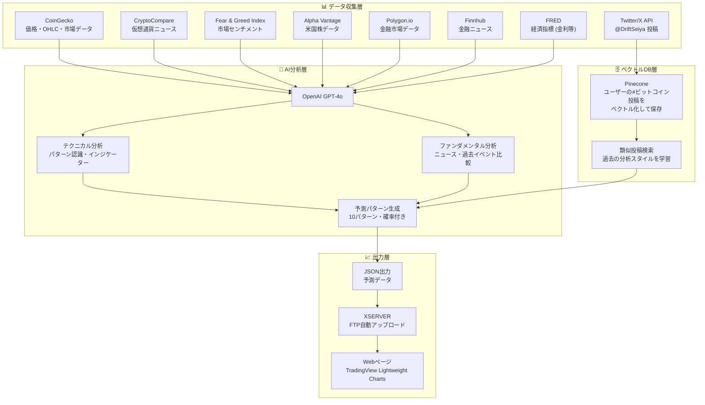
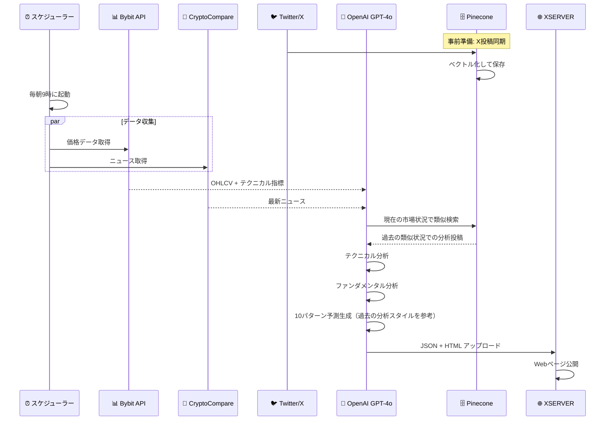
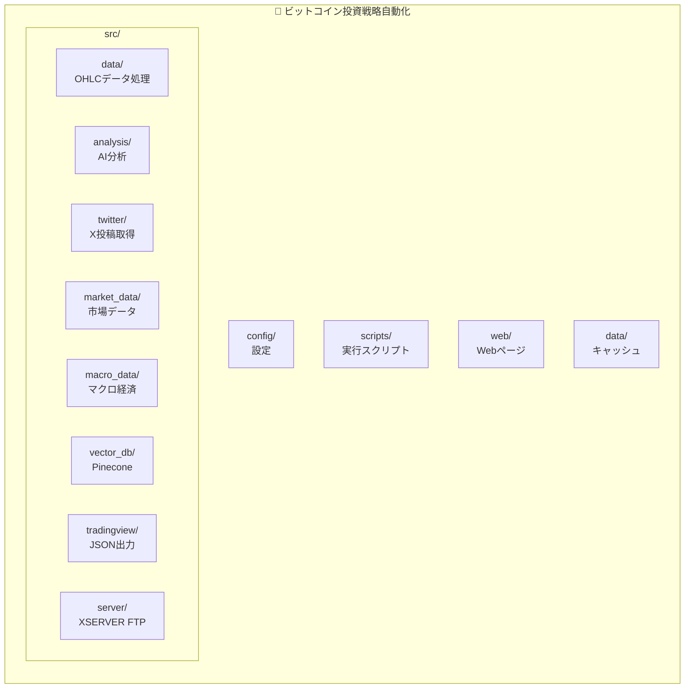

# 🪙 ビットコイン投資戦略自動化

AIによるビットコインのテクニカル・ファンダメンタル分析を行い、Webページに複数の予想チャートパターンを確率順に表示するシステム。

## 📋 概要

| 項目 | 内容 |
|------|------|
| **目的** | BTC価格の将来予測パターンを自動分析・可視化 |
| **分析手法** | テクニカル分析 + ファンダメンタル分析 + 過去パターンマッチング |
| **価格データ** | CoinGecko API |
| **出力** | Webページに10パターンの予想チャート（確率順） |
| **ホスティング** | XSERVER（FTP自動アップロード） |
| **実行頻度** | 毎日朝9時（日足確定後） |
| **対象時間足** | 日足・週足・月足 |

## 🏗️ システムアーキテクチャ



## 🔄 処理フロー



## 📁 フォルダ構造



```
ビットコイン投資戦略自動化/
├── .github/               # GitHub設定・ドキュメント
│   ├── workflows/
│   │   └── daily_analysis.yml  # 毎日9時に自動実行
│   ├── README.md
│   └── copilot-instructions.md
├── src/
│   ├── __init__.py
│   ├── data/              # OHLCデータ処理
│   │   ├── __init__.py
│   │   └── ohlcv.py
│   ├── analysis/          # AI分析ロジック
│   │   ├── __init__.py
│   │   ├── technical.py   # テクニカル分析
│   │   ├── fundamental.py # ファンダメンタル分析
│   │   └── predictor.py   # 予測パターン生成
│   ├── twitter/           # X投稿取得（分析コンテキスト用）
│   │   ├── __init__.py
│   │   └── client.py
│   ├── market_data/       # 市場データ取得
│   │   ├── __init__.py
│   │   ├── cryptocompare.py  # CryptoCompare ニュース
│   │   ├── coingecko.py      # CoinGecko 価格・OHLC・市場データ
│   │   └── fear_greed.py     # Fear & Greed Index
│   ├── macro_data/        # マクロ経済データ取得
│   │   ├── __init__.py
│   │   ├── fred.py           # FRED 経済指標
│   │   ├── alpha_vantage.py  # Alpha Vantage 株式データ
│   │   ├── polygon.py        # Polygon.io 市場ステータス
│   │   └── finnhub.py        # Finnhub 金融ニュース
│   ├── vector_db/         # Pinecone連携
│   │   ├── __init__.py
│   │   └── pinecone_client.py
│   ├── tradingview/       # JSON出力・アラート生成
│   │   ├── __init__.py
│   │   └── webhook.py
│   └── server/            # XSERVER FTP連携
│       ├── __init__.py
│       └── xserver_uploader.py
├── web/                   # Webページテンプレート
│   ├── index.html
│   └── lightweight-charts.js
├── config/                # 設定ファイル
│   ├── __init__.py
│   └── settings.py
├── scripts/               # 実行スクリプト
│   ├── run_analysis.py              # ② 予測生成処理
│   ├── sync_tweets_to_pinecone.py   # ① X APIからPineconeへ同期
│   └── import_tweets_from_archive.py # ③ Twitter Archiveインポート
├── data/                  # ローカルキャッシュ
│   └── latest_prediction.json
├── logs/                  # ログファイル
├── .gitignore
└── requirements.txt
```

## 🛠️ 実行スクリプト

### ① X APIからPineconeへ同期 + ② 予測生成処理

**GitHub Actionsで毎日9時（JST）に自動実行：**

1. X投稿を最大2件取得 → Pineconeへ保存
2. BTC予測生成 → XSERVERにアップロード

> **⚠️ X API Free Tier制限**: 月100件まで。毎日2件×30日=60件/月で運用。

```bash
# 手動実行する場合

# X同期：状態確認
python scripts/sync_tweets_to_pinecone.py --status

# X同期：差分取得（新しい投稿のみ）
python scripts/sync_tweets_to_pinecone.py --max-tweets 100

# X同期：全過去投稿を一括取得（API制限注意：7日分のみ取得可能）
python scripts/sync_tweets_to_pinecone.py --fetch-all

# 予測生成
python scripts/run_analysis.py
```

### ③ Twitter Archiveインポート（手動・初回のみ）

**X API Free Tierは月7日分・月100件制限**のため、過去の投稿はTwitter Archiveからインポートします。

```bash
# プレビュー（Pineconeに保存しない）
python scripts/import_tweets_from_archive.py path/to/tweets.js --preview

# 本番インポート
python scripts/import_tweets_from_archive.py path/to/tweets.js
```

> **手順**: X設定 → アカウント → データのアーカイブをダウンロード → ZIP解凍 → `data/tweets.js` を指定

## 📄 ライセンス

MIT License

## 👤 作者

[@DriftSeiya](https://x.com/DriftSeiya)